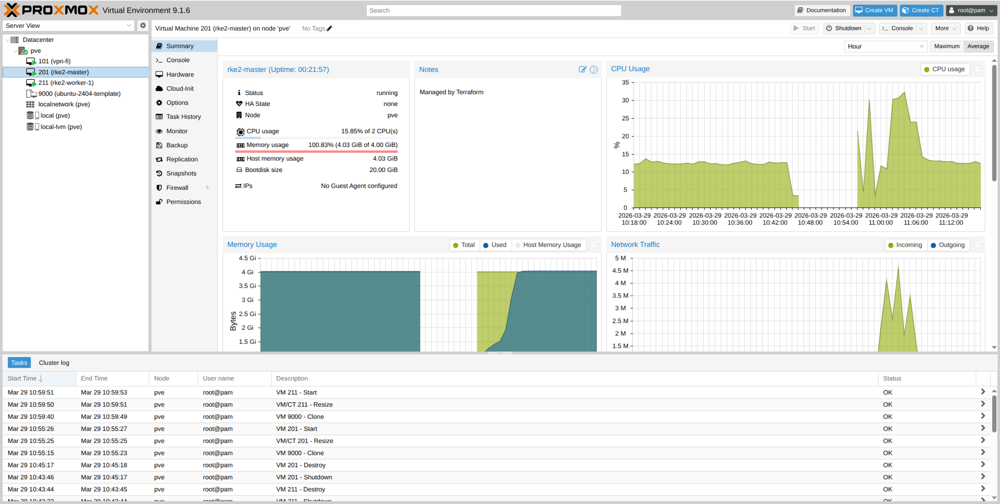

# proxmox_k8s

Terraform project to provision an [RKE2](https://docs.rke2.io/) Kubernetes cluster on [Proxmox VE](https://www.proxmox.com/en/proxmox-virtual-environment/overview).

## Architecture

This project creates a 2-node RKE2 cluster:

- **Master node** — runs the RKE2 server (control plane + etcd)
- **Worker node** — runs the RKE2 agent (joins the cluster as a worker)

Both VMs are cloned from a cloud-init-ready Ubuntu template and provisioned automatically via `remote-exec`.

## Prerequisites

- Proxmox VE host with API access
- A cloud-init-ready VM template (e.g., Ubuntu cloud image) already created on Proxmox
- Terraform >= 1.9.8
- SSH key pair for VM access
- Proxmox API token ([how to create one](https://pve.proxmox.com/wiki/User_Management#pveum_tokens))

## Quick Start

1. **Clone the repository**

   ```bash
   git clone <repo-url>
   cd proxmox_k8s
   ```

2. **Create your variables file**

   ```bash
   cp terraform.tfvars.example terraform.tfvars
   ```

3. **Edit `terraform.tfvars`** with your values:

   ```hcl
   proxmox_api_url   = "https://192.168.1.100:8006/api2/json"
   proxmox_api_token = "user@pam!tokenid=uuid"
   target_node       = "pve"
   template_vm_id    = 9000
   ssh_public_key    = "ssh-rsa AAAAB3Nza..."
   network_gateway   = "192.168.1.1"
   master_ip         = "192.168.1.101/24"
   worker_ip         = "192.168.1.102/24"
   rke2_token        = "your-secure-token-here"
   ```

4. **Initialize and apply**

   ```bash
   terraform init
   terraform plan -var-file=./terraform.tfvars
   terraform apply -var-file=./terraform.tfvars
   ```

5. **Get the kubeconfig**

   ```bash
   ssh devops@<master-ip> "sudo cat /etc/rancher/rke2/rke2.yaml" > kubeconfig.yaml
   sed -i 's/127.0.0.1/<master-ip>/g' kubeconfig.yaml
   export KUBECONFIG=./kubeconfig.yaml
   kubectl get nodes
   ```

## Variables

### Required

| Variable | Description |
|----------|-------------|
| `proxmox_api_url` | Proxmox API endpoint (must start with `https://`) |
| `proxmox_api_token` | Proxmox API token (sensitive) |
| `template_vm_id` | VM ID of the cloud-init template to clone |
| `ssh_public_key` | Public SSH key added to VMs |
| `rke2_token` | RKE2 cluster registration token (sensitive) |
| `network_gateway` | Network gateway IP |
| `master_ip` | Master node static IP in CIDR notation (e.g., `192.168.1.101/24`) |
| `worker_ip` | Worker node static IP in CIDR notation (e.g., `192.168.1.102/24`) |

### Optional

| Variable | Default | Description |
|----------|---------|-------------|
| `target_node` | `pve` | Proxmox node name |
| `proxmox_insecure` | `true` | Skip TLS verification for Proxmox API |
| `proxmox_ssh_username` | `root` | SSH username for the Proxmox host |
| `ssh_private_key_path` | `~/.ssh/id_rsa` | Path to SSH private key for provisioning |
| `rke2_version` | `""` (latest) | RKE2 version to install (e.g., `v1.32.4+rke2r1`) |
| `network_bridge` | `vmbr0` | Proxmox network bridge |
| `vm_username` | `devops` | Username created on VMs via cloud-init |
| `vm_disk_datastore_id` | `local-lvm` | Proxmox datastore for VM disks |
| `master_vm_id` | `201` | VM ID for the master node |
| `master_vm_name` | `rke2-master` | VM name for the master node |
| `master_cores` | `2` | CPU cores for the master node (min: 1) |
| `master_memory` | `4096` | Memory in MB for the master node (min: 2048) |
| `worker_vm_id` | `211` | VM ID for the worker node |
| `worker_vm_name` | `rke2-worker-1` | VM name for the worker node |
| `worker_cores` | `2` | CPU cores for the worker node (min: 1) |
| `worker_memory` | `4096` | Memory in MB for the worker node (min: 2048) |
| `vm_disk_size` | `20` | Disk size in GB for each VM (min: 10) |

## Outputs

| Output | Description |
|--------|-------------|
| `master_ip` | Master node IP address (sensitive) |
| `worker_ip` | Worker node IP address (sensitive) |
| `kubeconfig_instruction` | Instructions for retrieving the kubeconfig |

Use `terraform output -raw master_ip` to view sensitive outputs.

## Provisioning Details

During VM creation, the following steps are automated via `remote-exec`:

**Master node:**
1. Install and enable QEMU guest agent
2. Install RKE2 server (optionally pinned to `rke2_version`)
3. Configure RKE2 with the cluster token
4. Start `rke2-server.service`

**Worker node** (waits for master to complete):
1. Install and enable QEMU guest agent
2. Install RKE2 agent
3. Configure RKE2 to join the master at `https://<master-ip>:9345`
4. Start `rke2-agent.service`

## Results

### Proxmox Dashboard



### Terraform Apply Output

```
module.rke2_worker.proxmox_virtual_environment_vm.node: Still creating... [3m10s elapsed]
module.rke2_worker.proxmox_virtual_environment_vm.node (remote-exec): (output suppressed due to sensitive value in config)
module.rke2_worker.proxmox_virtual_environment_vm.node: Creation complete after 3m19s [id=211]

Apply complete! Resources: 2 added, 0 changed, 0 destroyed.

Outputs:

kubeconfig_instruction = "SSH into the master node and find the kubeconfig at /etc/rancher/rke2/rke2.yaml"
master_ip = "<MASTER_IP>/24"
worker_ip = "<WORKER_IP>/24"
```

### Kubernetes Cluster

```
$ kubectl get no -o wide
NAME            STATUS   ROLES                AGE     VERSION          INTERNAL-IP       EXTERNAL-IP   OS-IMAGE             KERNEL-VERSION      CONTAINER-RUNTIME
rke2-master     Ready    control-plane,etcd   7m19s   v1.34.5+rke2r1   <MASTER_IP>       <none>        Ubuntu 24.04.4 LTS   6.8.0-106-generic   containerd://2.1.5-k3s1
rke2-worker-1   Ready    <none>               4m45s   v1.34.5+rke2r1   <WORKER_IP>       <none>        Ubuntu 24.04.4 LTS   6.8.0-106-generic   containerd://2.1.5-k3s1
```

## Destroy

```bash
terraform destroy -var-file=./terraform.tfvars
```

## Project Structure

```
proxmox_k8s/
├── modules/
│   └── rke2-node/                  # Reusable VM + RKE2 setup module
│       ├── main.tf                 # VM resource + provisioner logic
│       ├── variables.tf            # role, IP, cores, memory, etc.
│       └── outputs.tf              # VM IP, VM ID
├── main.tf                         # Calls rke2-node module for master + worker
├── provider.tf                     # Proxmox provider configuration
├── variables.tf                    # Top-level input variables with validation
├── outputs.tf                      # Cluster outputs
├── terraform.tfvars.example        # Example configuration
├── .gitignore                      # Excludes state, keys, and secrets
└── README.md
```
